layout: true

```{r share-again, echo=FALSE}
xaringanExtra::use_share_again()
xaringanExtra::style_share_again(share_buttons = "none")

```


# Was sind räumliche Daten? <!--2-->

---


<!-- https://pixabay.com/de/photos/karten-google-maps-navigation-4237764/ -->


???
Räumliche Daten sind mittlerweile omnipräsent

---

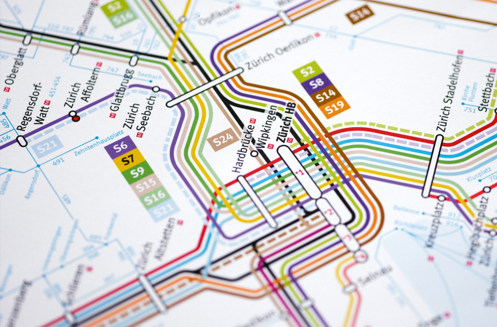

---

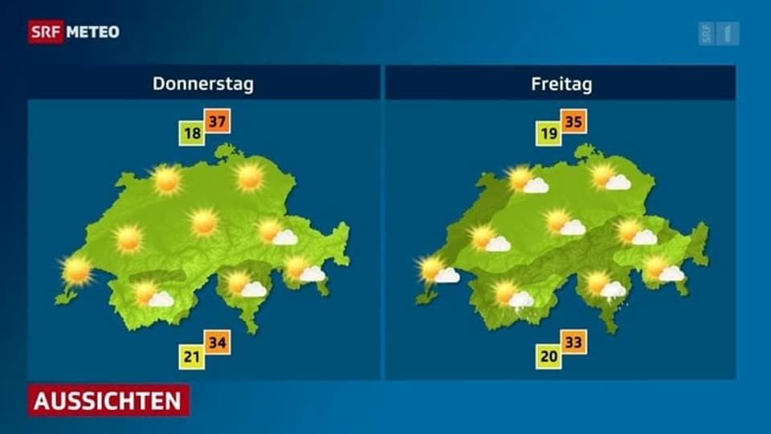


---


<!-- https://www.nature.com/articles/d41586-019-03060-y -->

???
Räumlich muss sich nicht immer auf unsere Erde beziehen!

Zelluläre Prozesse haben durchaus räumlichen Charakter

---

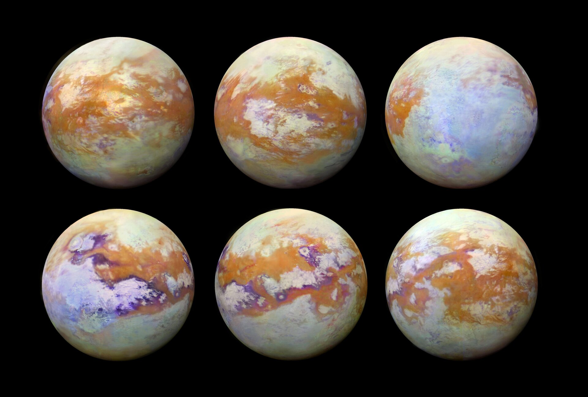
<!-- https://www.esa.int/Space_in_Member_States/Germany/Mit_Infrarot-Augen_auf_Titan_blicken -->

???
Räumlich muss sich nicht immer auf unsere Erde beziehen!

Infrarotaufnahmen von Titan, einem Saturn-Mond aus der Cassini-Huygens mission

---
class: highlight-last-item

--
- Räumliche Daten sind Daten mit einem *Raumbezug* 

--
  - typischerweise handelt es sich um einen 2- oder 3-dimensionaler Raum
  
--
  - engl: spatial data

--
- *Geo*daten sind räumliche Daten mit Bezug zur Erde

--
  - 2-, 3- oder n- dimensionaler Raum

--
- Sie berücksichtigen Attribute (die Semantik) und ihre räumliche Information

--
- das "was" und das "wo"

--
- beide Aspekte können auf unterschiedliche Art und Weise beschrieben werden (konzeptionelle Raummodelle)


???


Semantik: Bedeutung, Inhalt (eines Wortes, Satzes oder Textes)


---
layout: true

# Konzeptionelle Raummodelle <!--5-->

---
class: highlight-last-item


--
- **Entitäts-Modell**

--
  - Der Raum ist mit *diskreten Objekten* bevölkert
  
--
  - jedes Objekt verfügt über ein oder mehrere Attribute
  
--
  - jedes Objekt hat einen bestimmte Geometrie (Punkt, Linie oder Polygon)
  
--
  - entspricht einem Vektor-Datenformat

--
- **Feld-Modell**

--
  - die räumliche Eigenheit hat eine *kontinuierliche räumliche Existenz*
  
--
  - jeder Punkt im Raum hat einen Wert
  
--
  - entspricht einem Raster-Datenformat
  


---
.pull-left[
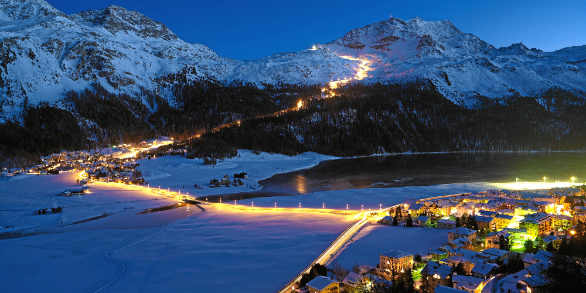
Skigebiet St Moritz:

- Hotels
- Ski Lifte
- Wälder
- Strassen
- Berge
]

--

.pull-right[
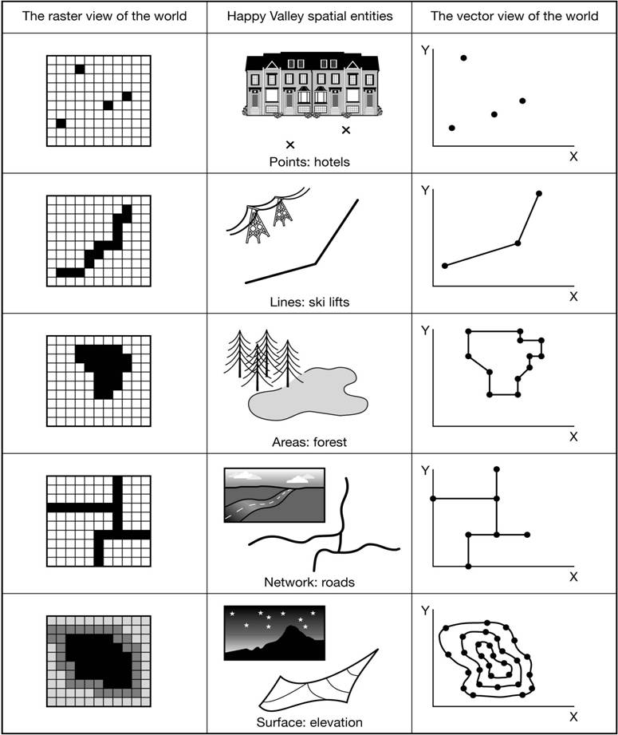
<!-- source: http://www.newdesignfile.com/postpic/2012/08/vector-and-raster-data-gis_131635.jpg -->
<!-- Bildquelle: Heywood, I. et al. (2006). An Introduction to Geographical Information Systems, Pearson. -->

]

---

layout: true
# Entitätenmodel: Vector Datenformat <!--2-->

```{r, echo = FALSE, message=FALSE, warning=FALSE}
library(sf)
library(purrr)
library(ggplot2)
library(dplyr)
my_geopackage <- "_data/processed/st_moritz.gpkg"

mylayers <- st_layers(my_geopackage)$name

mylayers <- setNames(mylayers, mylayers)
datasets <- map(mylayers, ~read_sf(my_geopackage, .x))

datasets <- map(datasets, ~st_transform(.x, 2056))

```


---

## Punkte


```
   name                            geom
   <chr>                    <POINT [m]>
 1 Europa             (2782399 1150371)
```


```{r, echo = FALSE, fig.height=5}

set.seed(10)

myhotel <- sample_n(datasets[["hotels"]], 10)

ggplot() +
  geom_sf(data = myhotel)  +
  coord_sf(datum = 2056) +
  theme_classic()
```


---

## Linien  <!--2-->


```
  name                                                                        geom
  <chr>                                                      <MULTILINESTRING [m]>
1 Via Nouva ((2785946 1153895, 2785913 1153864, 2785870 1153819, 2785812 1153755))
```


```{r, echo = FALSE, fig.height=5}

set.seed(10)

myroad <- sample_n(datasets[["roads"]], 1)
ggplot() +
  geom_sf(data = myroad) +
  geom_sf(data = st_cast(myroad, "POINT",warn = FALSE)) +
  coord_sf(datum = 2056) +
  theme_classic()
```


---

## Polygone  <!--2-->

```
  name                                                                           geom
  <chr>                                                            <MULTIPOLYGON [m]>
1 Hafnerwald (((2787615 1149733, 2787620 1149732, 2787612 1149732, 2787615 1149733)))
```


```{r, echo = FALSE, fig.height=5}

set.seed(10)

myforest <- sample_n(datasets[["forest"]], 1)

ggplot() +
  geom_sf(data = myforest) +
  geom_sf(data = st_cast(myforest, "POINT",warn = FALSE)) +
  coord_sf(datum = 2056) +
  theme_classic()
```


---
layout: false

# Feldmodell: Raster Datenformat <!--2-->


```{r, echo=FALSE, fig.height=5.5, warning=FALSE}
library(terra)
library(tmap)
dhm200 <- rast("_data/processed/dhm200_2056.tif")

dhm200_st_moriz <- crop(dhm200, datasets[["bbox"]])

tm_shape(dhm200_st_moriz) + tm_raster() +
  tm_layout(legend.show = FALSE) +
  tm_grid(lines = FALSE)

```


---
layout: true

# Koordinatensysteme  <!--4-->

---

.pull-left[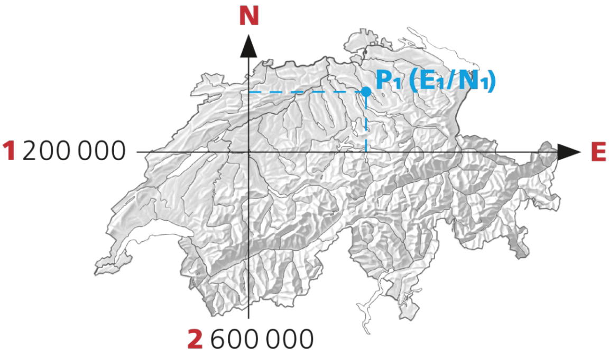]

.pull-right[
- die dargestellten Koordinaten beziehen sich auf ein Koordinatenreferenzsystem der Schweiz (`CH1903+LV95`)
- der "Ursprung" (`1'200'000 / 2'600'000`) dieses Koordinatenreferenzsystem liegt in Bern (alte Sternwarte)
- der Nullpunkt (`0 / 0`) liegt ausserhalb der Schweiz (im Atlantik)

]

---

.pull-left[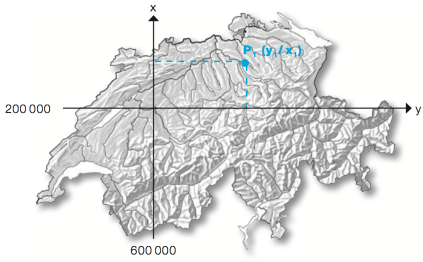]

.pull-right[
- altes schweizer Koordinatenreferenzsystem (`CH1903 LV03`)
- musste aufgrund von Messungenauigkeiten und Bodenbewegungen ersetzt werden
- ist am Zahlenbereich leicht zu erkennen
- der Ursprung (`200'000 / 600'000`) liegt ebenfalls in Bern
- der Nullpunkt (`0 / 0`) liegt ausserhalb der Schweiz (im Atlantik)
]

---


.pull-left[


]

.pull-right[

beide Koordinatenreferenzsysteme 

- sind nur auf die Schweiz und Liechtenstein anwendbar
- sind in Meter zu verstehen
- sind *projezierte Koordinatenreferenzsysteme*
]

---


layout: true

# Projektionen  <!--4-->

---

.pull-left[
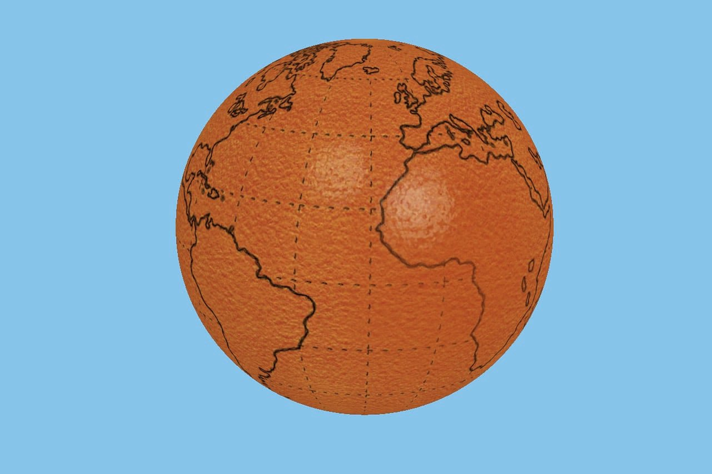
]

.pull-right[
- die Form der Erde lässt nur mit Verzerrungen auf eine 2D Fläche zwingen ("Orangenschalen-Problematik")
- diese Verzerrungen kann man räumlich minimieren
- So entwickelten sich eine Vielzahl unterschiedliche Projektionen und Koordinatenreferenzsystem
]

---

.pull-left[

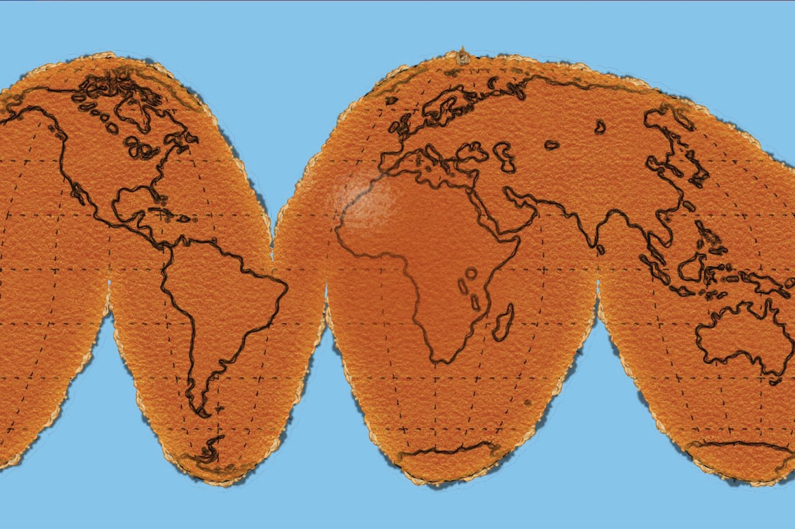
]

.pull-right[

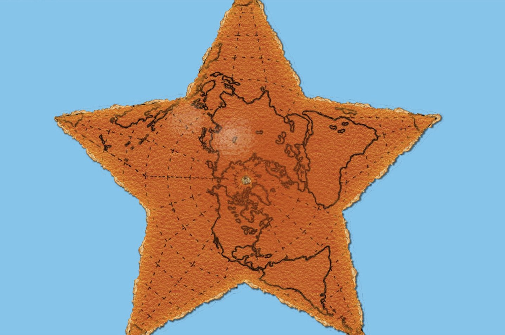
]

---

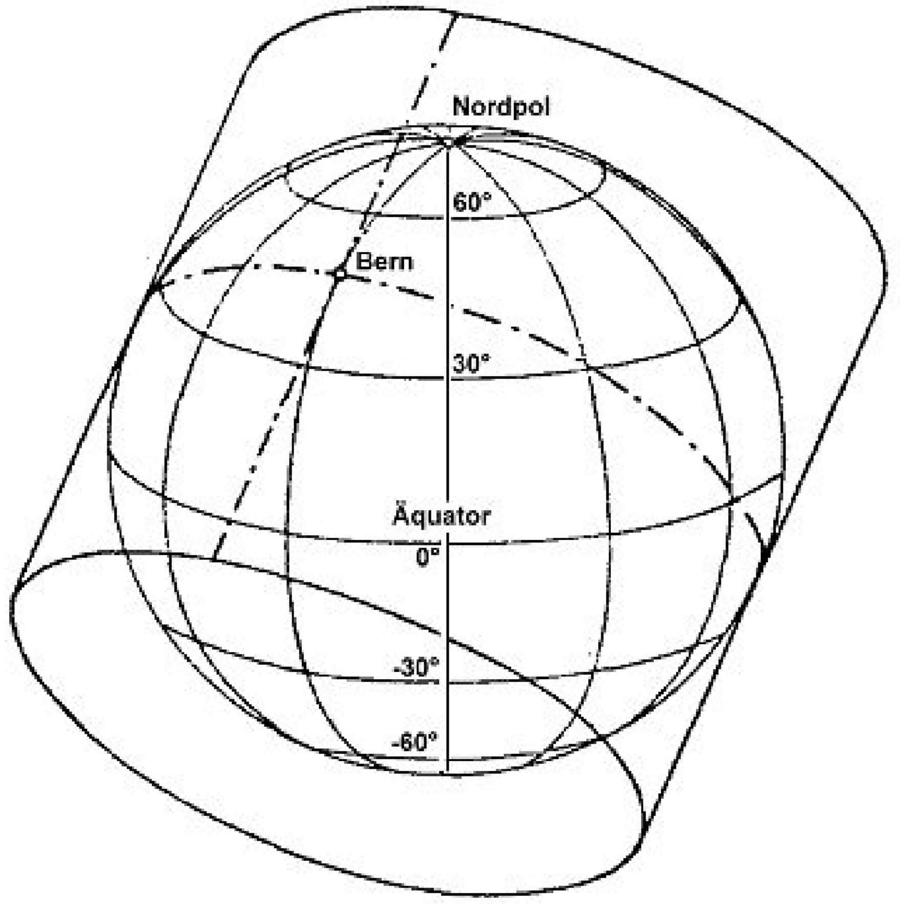

das Koordinatenreferenzsystem der Schweiz verwendet eine *schiefachsige, winkeltreue Zylinderprojektion*

---
layout: true

# Geographische Koordinatensysteme  <!--4-->

---

.pull-left[
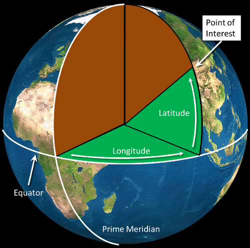
<!-- https://gsp.humboldt.edu/olm_2018/Lessons/GIS/01%20SphericalCoordinates/Latitude_and_Longitude.html -->
]

.pull-right[
*Geografische Koordinatensysteme*:

- verwenden Längen- und Breitengrade
- sind für globale Daten sinnvoll
- sind für kleinräumige Anwendungen umständlich 
- unterliegen ebenfalls räumlichen ungenauigkeiten 
- sind in einer Vielzahl verfügbar, für uns relevant ist v.a. *WGS84*
]

???

- Projizierte Koordinatensysteme (wie `CH1903 LV95`) sind nur auf bestimmte Regionen anwendbar
(Distanzen, Winkel und Flächen sind schwierig zu berechnen)
(die Erde ist eine Kartoffel)


