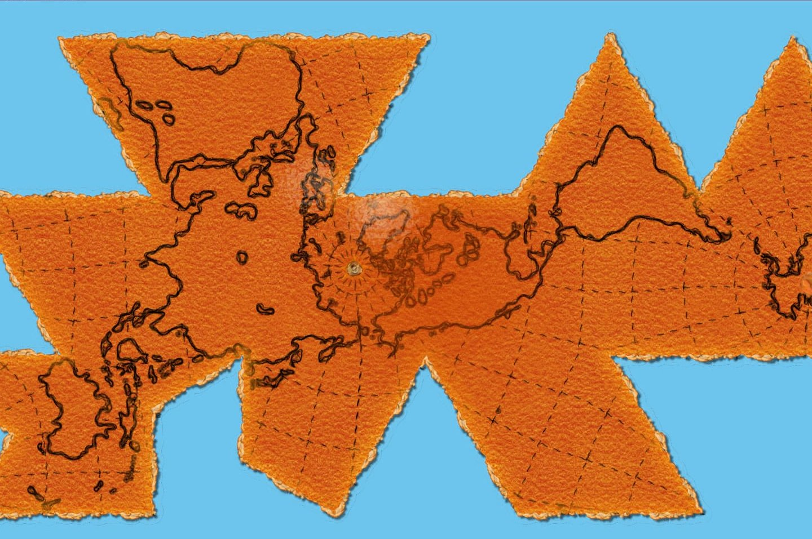

```{r share-again, echo=FALSE}
xaringanExtra::use_share_again()
xaringanExtra::style_share_again(share_buttons = "none")

```


<iframe src="https://www.zhaw.ch/en/about-us/person/rata/" style="border:0px #ffffff none;" name="myiFrame" scrolling="yes" frameborder="1" marginheight="0px" marginwidth="0px" height="700px" width="100%" allowfullscreen></iframe>

---

## Tagesablauf <!--2-->

```{r, echo = FALSE, results='asis'}
rl <- readLines("Drehbuch.md")

rl <- rl[startsWith(rl, "##")]

plan <- paste("-",sapply(strsplit(rl, "### "), function(x){x[2]}))

cat(plan, sep = "\n")

```

---
layout: true

# Was sind räumliche Daten? <!--2-->

---


<!-- https://pixabay.com/de/photos/karten-google-maps-navigation-4237764/ -->


???
Räumliche Daten sind mittlerweile omnipräsent

---


---


---


<!-- https://www.nature.com/articles/d41586-019-03060-y -->

???
Räumlich muss sich nicht immer auf unsere Erde beziehen!

Zelluläre Prozesse haben durchaus räumlichen Charakter

---


<!-- https://www.esa.int/Space_in_Member_States/Germany/Mit_Infrarot-Augen_auf_Titan_blicken -->

???
Räumlich muss sich nicht immer auf unsere Erde beziehen!

Infrarotaufnahmen von Titan, einem Saturn-Mond aus der Cassini-Huygens mission

---

- Räumliche Daten sind Daten mit einem *Raumbezug* 
  - typischerweise handelt es sich um einen 2- oder 3-dimensionaler Raum
  - engl: spatial data
- *Geo*daten sind räumliche Daten mit Bezug zur Erde
  - 2-, 3- oder 4-\* dimensionaler Raum
  

\* Zeitliche Dimension


---
layout: false
exclude: true

# Für eine Geodatenanalyse brauche ich

* Ein __Modell__ zur Abbildung der Umwelt
  * Konzeptionelle Datenmodelle: __Entitäten__ oder __Felder__
* __Datenstrukturen__ zur Speicherung der Lage und Attribute
  * Vektor (Punkte, Linien, Polygone) oder Raster
  * jeweils mit den bekannten R Datentypen: character, numeric, vector
  * mit einem Koordinatensystem (WGS84, CH1903+ LV95)
* Räumliche __Beziehungen__ für die Analyse
  * Geometrie (x,y,z)
  * Topologie (räumliche Beziehungen zwischen Objekten)

---
layout: true

# Konzeptionelle Raummodelle <!--5-->

---

- Geodaten berücksichtigen Attribute (die Semantik) und ihre räumliche Information
- das "was" und das "wo"
- beide Aspekte können auf unterschiedliche Art und Weise beschrieben werden
- **Entitäts-Modell**
  - Der Raum ist mit *diskreten Objekten* bevölkert
  - jedes Objekt verfügt über ein oder mehrere Attribute
  - jedes Objekt hat einen bestimmte Geometrie (Punkt, Linie oder Polygon)
  - entspricht einem Vektor-Datenformat
- **Feld-Modell**
  - Die zu untersuchende räumliche Eigenheit hat eine *kontinuierliche räumliche Existenz*
  - jeder Punkt im Raum hat einen Wert
  - entspricht einem Raster-Datenformat
  


---
.pull-left[

Skigebiet St Moritz:

- Hotels
- Ski Lifte
- Wälder
- Strassen
- Berge
]

--

.pull-right[

<!-- source: http://www.newdesignfile.com/postpic/2012/08/vector-and-raster-data-gis_131635.jpg -->
<!-- Bildquelle: Heywood, I. et al. (2006). An Introduction to Geographical Information Systems, Pearson. -->

]

---

layout: true
# Datenformat: Vector <!--2-->

---

## Punkte

.pull-left[
```
   name                            geom
   <chr>                    <POINT [m]>
 1 Europa             (2782399 1150371)
 2 Kulm               (2784447 1152572)
 3 Badrutt's Palace   (2784380 1152371)
 4 Monopol            (2784291 1152517)
 5 Misani             (2785587 1153966)
 6 Hotel Bären        (2784735 1152855)
```
]

.pull-right[

]


---

## Linien  <!--2-->

.pull-lef[
```
  name                                                                        geom
  <chr>                                                      <MULTILINESTRING [m]>
1 Via Nouva ((2785946 1153895, 2785913 1153864, 2785870 1153819, 2785812 1153755))
```
]


---

## Polygone  <!--2-->

```
  name                                                                           geom
  <chr>                                                            <MULTIPOLYGON [m]>
1 Hafnerwald (((2787615 1149733, 2787620 1149732, 2787612 1149732, 2787615 1149733)))
```


---
layout: true

# Koordinatensysteme  <!--4-->

---

.pull-left[]

.pull-right[
- die dargestellten Koordinaten beziehen sich auf ein Koordinatenreferenzsystem der Schweiz (`CH1903+LV95`)
- der "Ursprung" (`1'200'000 / 2'600'000`) dieses Koordinatenreferenzsystem liegt in Bern (alte Sternwarte)
- der Nullpunkt (`0 / 0`) liegt ausserhalb der Schweiz (im Atlantik)

]

---

.pull-left[]

.pull-right[
- altes schweizer Koordinatenreferenzsystem (`CH1903 LV03`)
- musste aufgrund von Messungenauigkeiten und Bodenbewegungen ersetzt werden
- ist am Zahlenbereich leicht zu erkennen
- der Ursprung (`200'000 / 600'000`) liegt ebenfalls in Bern
- der Nullpunkt (`0 / 0`) liegt ausserhalb der Schweiz (im Atlantik)
]

---


.pull-left[


]

.pull-right[

beide Koordinatenreferenzsysteme 

- sind nur auf die Schweiz und Liechtenstein anwendbar
- sind in Meter zu verstehen
- sind kartesische Koordinatensysteme ("die Erde ist Flach")
]

---
layout: true

# Projektionen  <!--4-->

---

.pull-left[

]

.pull-right[
- die Form der Erde lässt nur mit Verzerrungen auf eine kartesisches Koordinatensytem zwingen ("Orangenschalen-Problematik")
- diese Verzerrungen kann man räumlich minimieren. So entwickelten sich eine Vielzahl unterschiedliche Projektionen und Koordinatenreferenzsystem
]

---

.pull-left[


]

.pull-right[


]

---


das Koordinatenreferenzsystem der Schweiz verwendet eine *schiefachsige, winkeltreue Zylinderprojektion*

---
layout: true

# Geographische Koordinatensysteme  <!--4-->

---

.pull-left[

<!-- https://gsp.humboldt.edu/olm_2018/Lessons/GIS/01%20SphericalCoordinates/Latitude_and_Longitude.html -->
]

.pull-right[
- Projizierte Koordinatensysteme (wie `CH1903 LV95`) sind nur auf bestimmte Regionen anwendbar
- Daneben gibt es *Geografische Koordinatensysteme*, welche Längen- und Breitengrade verwenden
- Sind für globale Daten sinnvoll, für Lokale Anwendungen (kleines Untersuchungsgebiet) umständlich (Distanzen, Winkel und Flächen sind schwierig zu berechnen)
- Auch diese unterliegen Modellen der Erde und sind somit nur Annäherungen (die Erde ist eine Kartoffel)
- Es gibt verschiedene Geographische Koordinatensysteme, für uns relevant ist nur *WGS84*
]


