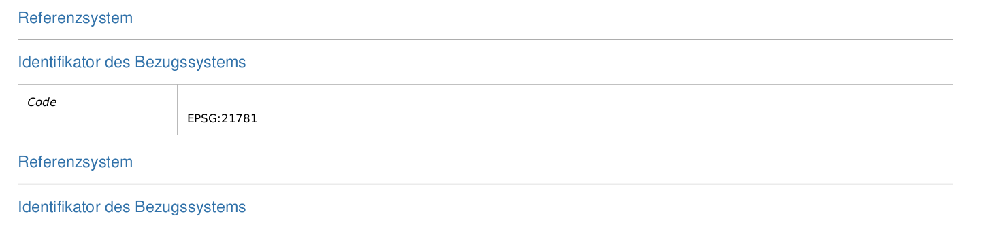
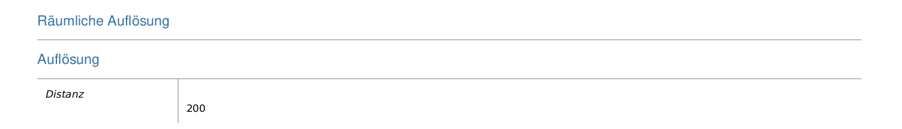

```{r share-again, echo=FALSE}
xaringanExtra::use_share_again()
xaringanExtra::style_share_again(share_buttons = "none")
```


## Vorbereitung <!--2-->

Installiere zudem das R Package `terra`

Erstelle dann ein neues R Script mit dem Namen `Uebung_3.R` und lade darin die libraries `sf` sowie `tmap`.


```{r, message = FALSE}
library(sf)
library(tmap)
```

---

## Übung 3.1 <!--10-->

- Such das digitale höhenmodell der Schweiz. 
- Auch hier kannst du die folgenden Adressen nutzen:
  - [opendata.swiss](https://opendata.swiss/)
  - [map.geo.admin.ch](https://map.geo.admin.ch)
  - [swisstopo.admin.ch](https://www.swisstopo.admin.ch)
- Entzippe das File (sofern nötig) und schau dir den Inhalt an

--

## Lösung

https://www.swisstopo.admin.ch/de/geodata/height/dhm25200.html

Shortlink (für diesen Kurs): https://bit.ly/3Hj4X0K


---
layout: true

## Input: Raster Datenformate  <!--4-->

---

Inhalt des heruntergeladenen zip-Files:

.pull-left[
### Eigentliche Daten:
- DHM200_polyface.dxf
- DHM200.asc
- DHM200.xyz
]

.pull-right[
### Metadaten und Lizenzbedigungen:
- license.txt
- Metadata_gm03.xml
- Metadata_PDF.pdf
- Metadata_xml_iso19139.xml
]

---

Der gleiche Datensatz (`DHM25 200`) in 3 unterschiedlichen Datenformaten:

- ~~DHM200_polyface.dxf~~
- DHM200.asc
- DHM200.xyz

???

- 3x die gleichen Daten!
- dxf wird eher im CAD bereich verwendet, dieses werden wir ignorieren (könnt ihr löschen)


---

## ESRI ArcInfo ASCII Grid  <!--1-->

- Dateierweiterung \*.asc
- ein Datenformat von ESRI (siehe die [Spezifikationen](http://old.geotools.org/ArcInfo-ASCII-Grid-format_5250.html))
- beginnt mit mehreren Zeilen Metaadaten, darauf folgen die eigentlichen Werte
- kann in einem Texteditor geöffnet werden:

```{}
NCOLS 1926
NROWS 1201
XLLCORNER 479900.
YLLCORNER 61900.
CELLSIZE 200.
NODATA_VALUE -9999.
-9999. -9999. -9999. -9999. -9999. -9999. -9999. -9999. -9999. -9999. -9999. -9999. 
...
...
...
835.415 863.55 887.424 869.213 855.539 845.878 829.714 815.258 807.458 799.816 799.2  
```

---

## ASCII Gridded XYZ  <!--1-->

- Dateierweiterung \*.xyz
- Ein offenes Format
- Beinhaltet 3 Spalten: x- und y- Koordinaten sowie Zellwert
- kann in einem Texteditor geöffnet werden:

```{}
655000.00 302000.00 835.01
655200.00 302000.00 833.11
655400.00 302000.00 831.20
```

---

Um Rasterdaten in R zu importieren verwenden wir das Package `terra`.

```{r eval = FALSE}
install.packages("terra")
```


```{r}
library(terra)

dhm200 <- rast("_data/dhm25_200/DHM200.xyz")
```

- Aus `terra` benötigen wir die Funktion `rast`
- das Importieren funktioniert gleich, unabhängig von der Dateierweiterung
- eine summarische Zusammenfassung erhält man via Konsole:

```{r, eval = FALSE}
dhm200
```


---

```{r, highlight.output=c(5)}
dhm200
```

---

Eine einfache Visualisierung erhält man mit dem `plot()` Befehl:

```{r, fig.width=10}
plot(dhm200)
```


---
layout: false

## Übung 3.2 <!--3-->

In welchem Koordinatensystem befindet sich dieses Höhenmodell? 

Tipp: Konsultiere die Metadaten!

--

## Lösung



&rarr; im alten Schweizer Koordinatensystem CH1903 LV03
---

## Übung 3.2 <!--3-->

Wie hoch ist die Auflösung?

--

## Lösung



&rarr; 200 Meter

---

## Übung 3.3 <!--3-->

Importiere `DHM200` in R und schau dir das Objekt in der Konsole sowie mit `plot()` an.

--

## Lösung


```{r, eval = FALSE}
dhm200 <- rast("_data/dhm25_200/DHM200.xyz")
dhm200
plot(dhm200)
```

---
layout: true
## Input: Koordinatenbezugssystem *festlegen*

---

- Das Koordinatenbezugssystem haben wir bereits für Vektordaten festgelegt
- dabei haben wir folgenden Befehl verwendet: 
- `st_crs(meinvektordatensatz) <- 21781` <- für das alte Schweizer Koordinatenbezugssystem
- für Rasterdaten funktioniert es leicht anders:

```{r}
crs(dhm200) <- "epsg: 21781"
```

--

- `crs()` statt `st_crs`
- `"epsg: 21781"` (mit Anführungs- und Schlusszeichen) statt `21781`

---


```{r, highlight.output=c(5)}
dhm200
```


---
layout: true

## Input: Koordinatenbezugssystem *transformieren*

---

- Das Koordinatenbezugssystem von `dhm200` ist das alte Schweizer Koordinatenbezugssytem (`CH1903 LV03` bzw. `EPSG: 21781`)
- Analog den Vektordaten sollten wir es in das *neue* Schweizer Koordinatenbezugssytem transformieren
- Für Vektordaten haben wir dafür den Befehl `st_transform` verwendet
- Die Analoge Funktion für Rasterdaten lautet `project`

```{r}
dhm200_2056 <- project(dhm200, "epsg: 2056")
```

---

```{r, highlight.output=c(5)}
dhm200
```


```{r, highlight.output=c(5)}
dhm200_2056
```


---
layout: false

## Übung 3.4 <!--4-->

Transformiere `dhm200` in das Koordinatenbezugssystem `CH1903 LV95`. Speichere den Output als `dhm200_2056`.

--

## Lösung

```{r}
dhm200_2056 <- project(dhm200, "epsg: 2056")
```


---

## Übung 3.5 <!--4-->

Visualisiere `dhm200_2056` mit `tmap`.

Tipp: Um ein Polygon zu visualisieren sind wir wie folgt vorgegangen

```{r, eval = FALSE}
tm_shape(gemeindegrenzen) + tm_polygons()
```

---

## Lösung

```{r, message=FALSE, warning=FALSE}
# tmap_mode("view") # optional
tm_shape(dhm200_2056) + tm_raster()
```


---

## Übung 3.6 <!--4-->

Verändere die Darstellungsweise des Rasters mithilfe von `style` und `palette`. Tipp, schau dir die Hilfe von `?tm_raster` an.

--

## Lösung

```{r, message=FALSE, warning=FALSE}
tm_shape(dhm200_2056) + tm_raster(style = "cont", palette = "viridis")
```

---

## Input <!--3-->

- Wir haben für `DHM200.xyz` das Koordinatenbezugssystem festlegen und in das neue System transformieren müssen. 

--

- Wir können unser verändertes Objekt (`dhm200_2056`) nun so exportieren, so dass diese Änderungen abgespeichert werden

--

```{r}
writeRaster(dhm200_2056,"_data/dhm200_2056.tif", overwrite = TRUE)
```

--

- beim Importieren ist nun R sofort klar, das es sich um ein Datensatz im neuen schweizer Koordinatenbezugssystem handelt (CRS setzen und transformieren ist nicht mehr nötig)

```{r}
dhm200_2056 <- rast("_data/dhm200_2056.tif")

dhm200_2056
```


---
class: highlight-last-item

## Rückblick

Wir haben...

--
- ein Höhenmodell der Schweiz heruntergeladen

--
- 3 unterschiedliche Datenformaten von Rasterdaten kennengelernt

--
- ein Rasterdatensatz mithilfe von `rast` aus `terra` in R importiert

--
- diesem Rasterdatensatz das korrekte Koordinatenbezugssystem zugewiesen (`crs`)

--
- diesen Rasterdatensatz in ein anderes Koordinatensystem transformiert (`project`)

--
- diesen Rasterdatensatz mit `plot()` sowie `tmap` visualisert

--
- mit verschiedenen Darstellungformen in `tmap` gearbeitet (optionen `style` und `palette`)

--
- das Höhenmodell weist in jeder Zelle genau *einen* Wert auf (die Höhe). Es gibt aber Situationen, wo wir mehreren Werten pro Zelle benötigen


