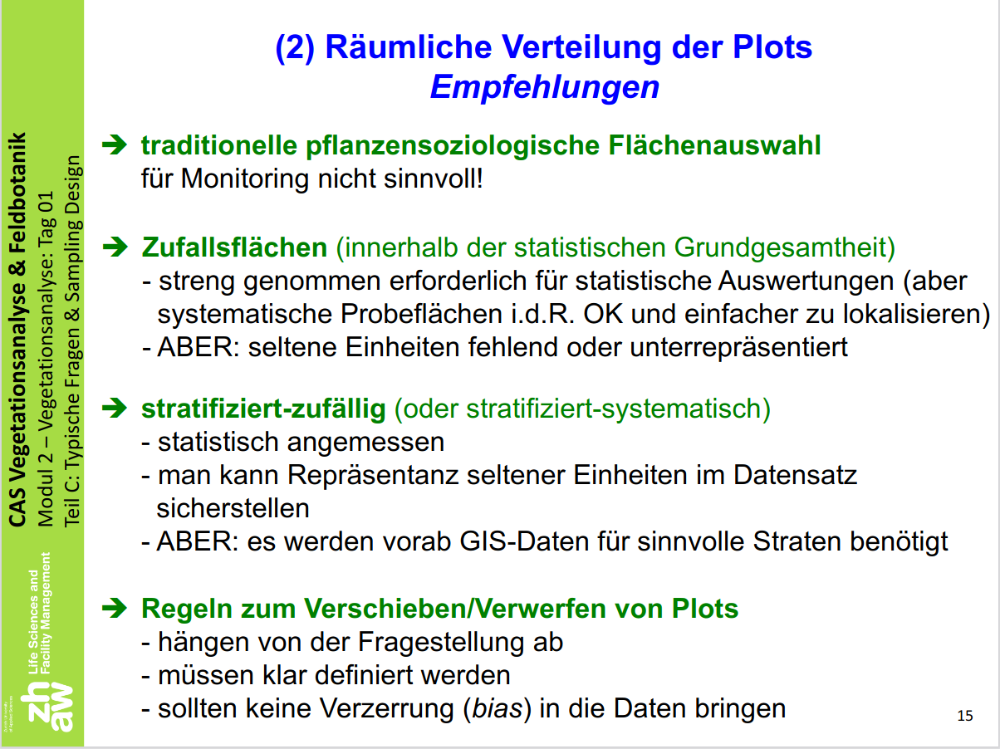

```{r share-again, echo=FALSE}
xaringanExtra::use_share_again()
xaringanExtra::style_share_again(share_buttons = "none")
```


## Sampling Desing mit R



???

R eignet sich hervorragend um ein Sampling Design umzusetzen

---

## Ausgangslage


```{r, warning=FALSE, message=FALSE}
library(sf)
library(terra)
library(tmap)
tmap_mode("plot")

tww_landquart <- read_sf("_data/processed/tww_landquart.gpkg")
```


```{r, echo = FALSE}
base_plot <- tm_shape(tww_landquart, bbox = tww_landquart[tww_landquart$Name %in% c("Prafieb","Frättis", "Jerätsch"),]) + 
  tm_polygons(col = "Name") + 
  tm_layout(legend.show = FALSE)
```

---
layout: true


## Zufällig und gleichmässig verteilt

---


- Gleich viele samples (10) pro *Multi*polygon
- Samples sind zufällig verteilt

```{r}
tww_landquart$equal_samples <- 10
sample_plots1 <- st_sample(tww_landquart, size = tww_landquart$equal_samples)
```


```{r, echo = FALSE, fig.height=5.5, message=FALSE}
base_plot +
  tm_shape(sample_plots1) +
  tm_dots(shape = 3)
```

---


- Gleich viele samples (10) pro ~~Multi~~polygon
- Samples sind zufällig verteilt


```{r, warning=FALSE}
tww_landquart_polygon <- st_cast(tww_landquart, "POLYGON")
```

--

.pull-left[

`tww_landquart` (`r nrow(tww_landquart)` Zeilen):

```{r, echo = FALSE}
knitr::kable(head(tww_landquart["Name"]))
```
]

--

.pull-right[

`tww_landquart_polygon` (`r nrow(tww_landquart_polygon)` Zeilen):

```{r, echo = FALSE}
knitr::kable(head(tww_landquart_polygon["Name"]))
```
]


```{r, warning=FALSE, echo = FALSE}
tww_landquart_polygon$equal_samples <- 10
sample_plots1b <- st_sample(tww_landquart_polygon, size = tww_landquart_polygon$equal_samples)
```


---

.pull-left[
```{r, echo = FALSE}
base_plot +
  tm_shape(sample_plots1) +
  tm_dots(shape = 3) +
  tm_layout(title = "10 samples pro MULTIpolygon")
```
]


.pull-right[
```{r, echo = FALSE}

tww_landquart_polygon$i <- as.character(seq_len(nrow(tww_landquart_polygon)))

tm_shape(tww_landquart_polygon, bbox = tww_landquart[tww_landquart$Name %in% c("Prafieb","Frättis", "Jerätsch"),]) + 
  tm_polygons(col = "i") + 
  tm_layout(legend.show = FALSE) +
  tm_shape(sample_plots1b) +
  tm_dots(shape = 3) +
  tm_layout(title = "10 samples pro Polygon")

```
]

---
layout: true

## Zufällig und in Abhängigkeit der Flächengrösse verteilt

---

- Anzahl Samples ist abhängig von der Flächengrösse (1 Sample pro 4'000 m2)
- Samples sind zufällig verteilt

```{r}

tww_landquart_polygon$SHAPE_Area <- st_area(tww_landquart_polygon) # Flächengrösse muss aktualisiert werden!

tww_landquart_polygon$relative_samples <- as.integer(round(tww_landquart_polygon$SHAPE_Area/4000))
```

--

```{r, echo = FALSE}
knitr::kable(head(tww_landquart_polygon[,c("Name","SHAPE_Area", "relative_samples")]))
```

--


```{r}
sample_plots2 <- st_sample(tww_landquart_polygon, size = tww_landquart_polygon$relative_samples)
```

---

```{r, echo = FALSE, fig.height=6.5}
base_plot +
  tm_shape(sample_plots2) +
  tm_dots(shape = 3)
```

---
layout: false

## Gleichmässig verteilt

- Regelmässige Verteilung der Samples (auf einem "Raster")
- Implizit abhängig von der Flächengrösse (grosse Polygone erhalten mehr Samples)

```{r}
sample_plots3 <- st_sample(tww_landquart, size = 200, type = "regular")
```

--

```{r, echo = FALSE}
base_plot +
  tm_shape(sample_plots3) +
  tm_dots(shape = 3)
```

---

## Übung (Open End, ohne Musterlösung)

- Wähle einen kleineren Kanton oder eine Gemeinde aus
- Selektiere die TWW Standorte dieser Gemeinde / dieses Kantons
- Wähle ein sinnvolles Sampling Design und setze es mit R um
- Extrahiere die Höhenwerte für jeden Sample
- Visualisere in einer Karte:
  - die TWW Flächen
  - Gemeinde- / Kantonsgrenze
  - Sampling Standorte
  - Swissimage Hintergrund Karte
  - Nordpfeil, Scalebar


